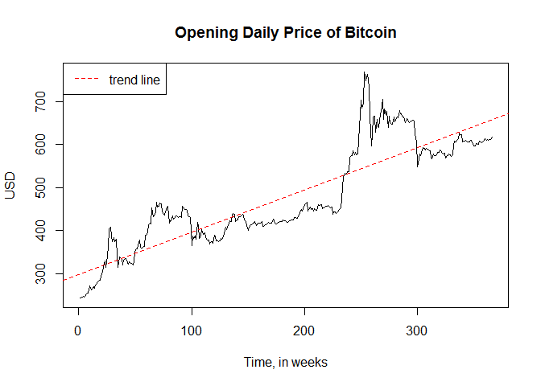
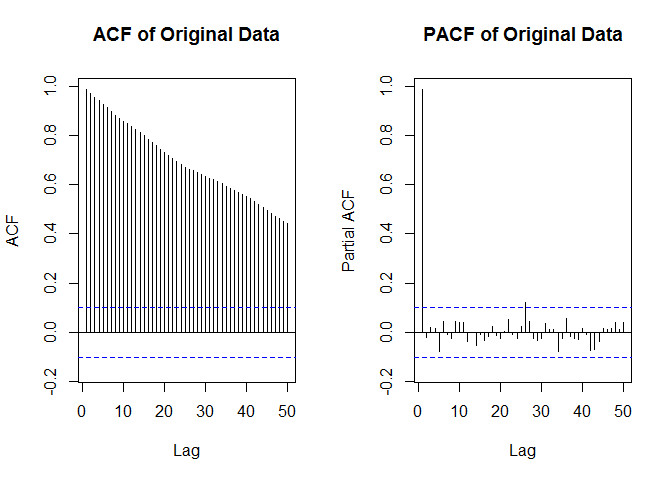
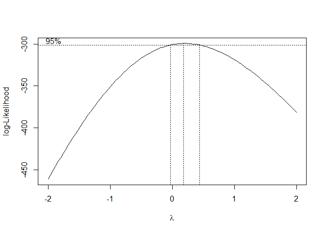
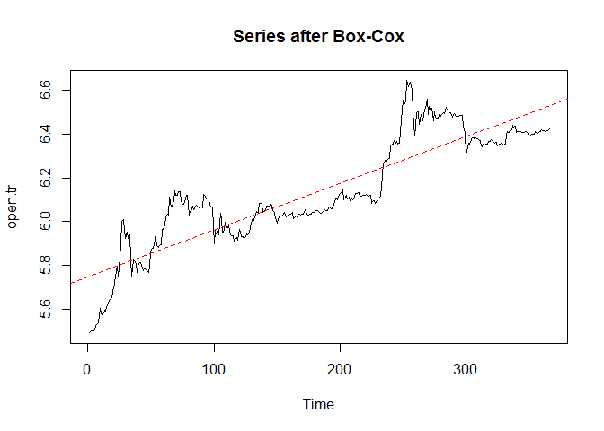
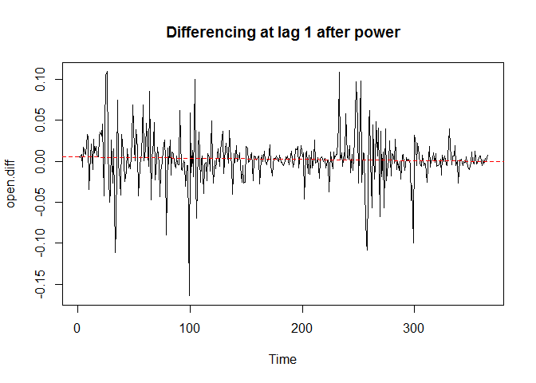
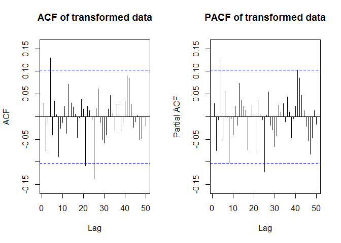
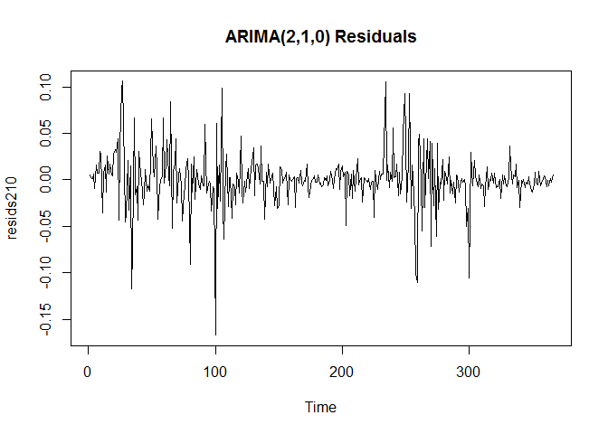
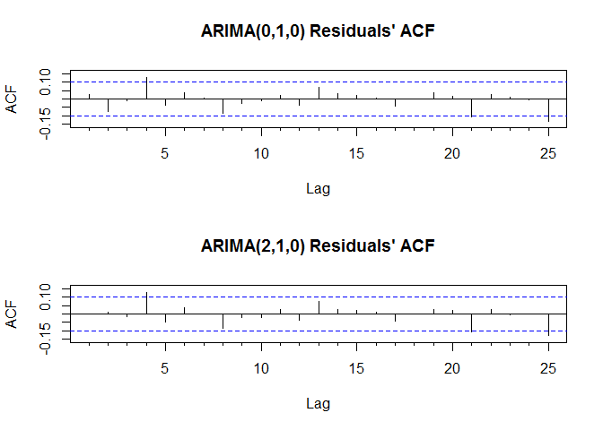
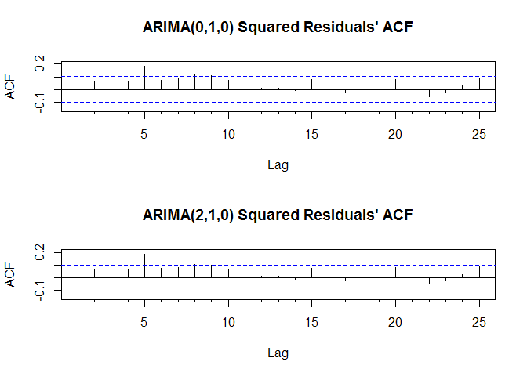

Predicting bitcoin opening price
================

This was my final project for PSTAT 174, Time Series, Fall 2017.

Note that the numbers cited in the documentation might be slightly off due to changes in random sampling in subsequent runs of the code.
----------------------------------------------------------------------------------------------------------------------------------------

Abstract
========

This analysis attempts to build an accurate forecasting model for the opening price of the bitcoin cryptocurrency, using data from an entire year and the Box-Jenkins methodology. This process consisted of model identification (after Box-Cox transformation and differencing), model selection by comparing AICc, parameter estimation using maximum likelihood estimation, and finally model diagnostics from looking at the ACF and PACF of the residuals.

As it turns out, the two models with the lowest AICc, ARIMA(0,1,0) and ARIMA(2,1,0), were similarly flawed on account of the inherent heteroskedasticity in the original data, which was discovered when running model diagnostics. Ultimately it was decided that the ARIMA model was unfeasible for modeling this particular dataset and the GARCH model would be better utilized for this situation. Having said that, both models resulted in very similar results and confidence intervals that contain the true values, with the ARIMA(2,1,0) proving only slightly more effective when forecasting only 10 values into the future. However, given that the coefficients of this model were not significant and in keeping with the principle of parsimony, we would opt for the ARIMA(0,1,0) random model with drift, *X*<sub>*t*</sub> = *X*<sub>*t* − 1</sub> + 0.0028 + *Z*<sub>*t*</sub>.

Introduction
============

This dataset is the opening price of the cryptocurrency bitcoin for 366 days, from Jun 26 2015 to Jun 26, 2016 (2016 being a leap year). Cryptocurrency is a digital currency, with bitcoin being the most well-known. It is untraceable and is known for its usage for purchasing illicit goods and services. With internet anonymity and privacy becoming more important in the modern day, the value of untraceable currency has skyrocketed in the past several years. I want to be able to forecast the value of bitcoin in the future, based off of its value in the past. The dataset was found on [Kaggle.com](https://www.kaggle.com/sudalairajkumar/cryptocurrencypricehistory/kernels), which in turn got the data from [coinmarketcap.com](https://coinmarketcap.com/).

Body
====

Preliminary Plots
-----------------

To first analyze the dataset, I want to read in the data and then plot its time series. The data is organized to where the values are the top are the most recent, and those at the bottom are the oldest, so I will have to reverse this. I'm going to subset the data to a certain range in the middle so that I can compare my forecasting with actual existing data. After doing this, I will plot the series along a trend line or 'line of best fit'.

``` r
set.seed(100)
bitcoin <- read.csv("bitcoin_price.csv")
data <- subset(bitcoin, select = c(Date, Open)) # selecting only opening price column
# flipping the data to go from oldest to newest
data2 <- data.frame(Date = data$Date[1655:1], Open = data$Open[1655:1])
# taking a 356 observation subset of the data
par(mfrow = c(1,1))
open <- data2$Open[790:1155]
plot.ts(open, main = "Opening Daily Price of Bitcoin", 
        ylab = "USD", xlab = "Time, in weeks")
abline(lm(open ~ as.numeric(1:length(open))), col = "red", lty = 2)
legend("topleft", legend = "trend line", col = "red", lty = 2)
```



Trend, Seasonality and Sharp Changes
------------------------------------

There is a very clear upward trend in the data, several sharp changes, and the mean is in no way constant over time. All of these are red flags that the data is not stationary. I do not believe from looking at the data that seasonality is an issue since there is no consistent change that occurs periodically. The issue of the trend can and will be addressed via differencing, and similarly seasonality can be addressed in this way but we need not do that here. The sharp changes do make a difference in terms of the variance, which we will attempt to make constant via power transformations such as through the Box-Cox transformation.

Transforming
------------

With the end goal of forecasting, the first step after looking at the data is to transform it to make it stationary, i.e. make it so the future behaves as the past. In order to determine the best way to do that, we should look at the ACF (auto-covariance) and PACF (partial auto-covariance) plots, which depict how data are affected by the observations that precede them. This will also give us an idea of the model for the data.

The *autocorrelation* of data, represented by the function *γ*<sub>*X*</sub> for some data *X*, is the correlation in the data between two different points in time. One of the conditions for stationarity of a dataset is for the autocorrelation between two points in time *t*<sub>1</sub> and *t*<sub>2</sub> to be equal to the autocorrelation of the difference between *t*<sub>1</sub> and *t*<sub>2</sub>. The *partial autocorrelation* is the original ACF, controlling for the values of the time series at all shorter lags. Properties of these plots help us determine the order of the AR and MA components of our ARMA model.

AR (auto-regressive) models depend on their past values, an error term, and sometimes a constant. MA (moving average) models depend linearly on the current and past values of white noise error terms (which is random). The combination of them, together with differencing, consitute the ARIMA model.

``` r
par(mfrow = c(1,2))
# library(forecast) is loaded
Acf(open, main = "ACF of Original Data", lag.max = 50)
Pacf(open, main = "PACF of Original Data", lag.max = 50)
```



The ACF of the data decays gradually, whereas the PACF cuts off abruptly. There are a few significant lags of the PACF at 4, 5, and 10, after which point the values can be taken as just zero. The gradual decay of the ACF tells us that we should difference the data, which would also address the issue of the upward trend.

### Box-Cox Transformation

We would like to begin by using the Box-Cox power transformation, which is a method that helps to Normalize data. This method finds a value *λ* which maximizes the log-likelihood and then the data is raised to the power of *λ*. The higher the likelihood, the better (more likely) the model parameter. Power transformations such as the Box-Cox help to stabilize the variance which is imperative for Box-Jenkins modeling.

``` r
par(mfrow = c(1,1))
# library(MASS) is loaded
bcTransform <- boxcox(open ~ as.numeric(1:length(open)))
```



``` r
# value of lambda which maxes log-likelihood
best.lambda <- bcTransform$x[which(bcTransform$y == max(bcTransform$y))]
best.lambda
```

    ## [1] 0.1818182

We see that the ideal value for *λ* that maximizes the likelihood is −0.020, but the log function, *λ* = 0, is within the confidence interval so we can use this instead. Here we will apply the transformation, then compare the variances of our original data with the transformed data.

``` r
# transforming the data
open.tr <- log(open)
# new time series plot
par(mfrow = c(1,1))
plot.ts(open.tr, main = "Series after Box-Cox")
abline(lm(open.tr ~ as.numeric(1:length(open.tr))), col = "red", lty = 2)
```



``` r
# comparing the variances of original and transformed data
var(open)
```

    ## [1] 14166.75

``` r
var(open.tr)
```

    ## [1] 0.06487496

Obviously the data still has a linear trend, but the variance is much smaller. We haven't differenced yet, so the upward trend is still apparent. The typical methodology is to difference at *d* = 1 when dealing with a linear upward trend such as this.

### Differencing

We only want to difference once and at lag 1 because we did not observe any seasonality when we first plotted the original time series. The differenced series will represent the *change* between observations that are *d* units of time apart, in this case, *d* = 1, which is to say one day apart. So our differenced (and transformed) data will represent the change from each value to the next, one day at a time.

``` r
par(mfrow = c(1,1))
open.diff <- diff(open.tr, lag = 1)
plot.ts(open.diff, main = "Differencing at lag 1 after power")
# plotting the trend line of the series
abline(lm(open.diff~ as.numeric(1:length(open.diff))), col = "red", lty = 2)
```



Note that the y-intercept for the trend line is now approximately zero, so our upward trend has been nullified by the differencing. It does concern us that the variance does not appear to be constant throughout (heteroskedasticity) in spite of the Box-Cox transformation being applied, which is theoretically the best power transformation available. In the graph it is noted how the variance is extremely small at certain points, and at other times very large. We can however proceed with an augmented Dickey-Fuller test which will determine whether the data is stationary or not by checking against null hypothesis that the sample has a unit root. If it doesn't, then it is stationary.

``` r
# library(tseries) is loaded
adf.test(open.diff, alternative = "stationary")
```

    ## Warning in adf.test(open.diff, alternative = "stationary"): p-value smaller than
    ## printed p-value

    ## 
    ##  Augmented Dickey-Fuller Test
    ## 
    ## data:  open.diff
    ## Dickey-Fuller = -7.0202, Lag order = 7, p-value = 0.01
    ## alternative hypothesis: stationary

Our p-value being lower than confidence level *α* = 0.05 gives us significant evidence to reject the null hypothesis that the data is not stationary, thereby concluding that it is. Satisfied by this, we can now move on with estimating the parameters of the model.

Parameter Estimation
--------------------

Now we want to try and estimate the order of the model i.e. values of *p* and *q*. We can start speculating on these values by plotting the ACF and PACF of the newly differenced series. We can get ideas on what the orders are by using the `auto.arima()` function on the original time series, as well as the ACF and PACF of our transformed series. We'll include *λ* = 0 as a part of our function so that it estimates a model of our Box-Cox transformed data.

``` r
# library(forecast) is loaded
# stepwise and approximation = F is slower, but more accurate
auto.fit <- auto.arima(open, stepwise = F, approximation = F, lambda = 0, ic = "aicc")
auto.fit
```

    ## Series: open 
    ## ARIMA(0,1,4) with drift 
    ## Box Cox transformation: lambda= 0 
    ## 
    ## Coefficients:
    ##          ma1      ma2      ma3     ma4   drift
    ##       0.0462  -0.0766  -0.0212  0.1660  0.0026
    ## s.e.  0.0519   0.0513   0.0503  0.0556  0.0017
    ## 
    ## sigma^2 estimated as 0.000833:  log likelihood=778.57
    ## AIC=-1545.14   AICc=-1544.91   BIC=-1521.74

Note the inclusion of a 'drift' constant in the model. The `auto.arima()` function only includes the drift if it improves the model, based on AICc, which is the information criterion we specified to judge the model on, something that will be explained in more detail later on. We note that the drift *μ* = 0.0028 with standard error 0.0016, so the confidence interval for it actually includes zero hinting at this being a rather insignificant drift.

We are given an ARIMA(0,1,0) model which is essentially a random walk. We can take a look at the ACF and PACF curves as well, and if there are virtually no lags at which either coefficient is significantly far from zero, then it would corroborate this conclusion since it would indicate there is no AR or MA order in the model of best fit. The inclusion of *d* = 1 in the auto-fitted model also tells us that differencing at lag 1 was the right decision.

``` r
par(mfrow = c(1,2))
Acf(open.diff, main = "ACF of transformed data", lag.max = 50)
Pacf(open.diff, main = "PACF of transformed data", lag.max = 50)
```



The ACF at lag 1 is not significantly far form zero, so we don't difference further lest we overdifference the series.

Looking at 50 lags of this series, we see that there are no lags at which the ACF or PACF are significant. This is consistent with our automatically fitted model using *p* = 0 and *q* = 0. This is a confidence interval however, and we do see that ACF and PACF are *nearly* significant at lag 2. A significant ACF at lag 2 would imply an MA component of order 2 (*q* = 2), while a significant PACF at lag 2 would imply an AR component of order 2 (*p* = 2) so it's important we don't rule them out completely.

### Akaike Information Criterion

AICc is a refinement of the AIC (Akaike Information Criterion), which is a formula based on the number of estimated parameters as well as the maximum likelihood estimator. The smaller the AIC, the stronger the model. The AICc corrects for finite sample sizes, addressing an issue with the AIC which can result in overfitting models, so we prefer it when fitting for an ARIMA model.

It is however important to note that the AIC (and AICc) depend on a model being univariate, linear, and with normally-distributed residuals. We know the first two are true from what we have done so far, but are unsure about the latter condition. It is something that we will diagnose in the model diagnostics.

Model Selection
---------------

For now we will just use the AICc to select a couple of models and determine later on if the residuals will be an issue.

``` r
# matrix of AIC values for p and q
# library(qpcR) and library(forecast) are loaded
AICc.mat <- matrix(data = NA, nrow = 3, ncol = 3, 
                  dimnames = list(paste("p =", 0:2),
                                  paste("q =", 0:2)))

# simulating arima models for p,q = 0,1,2,3,4 and d = 1
for (p in 0:2) {
    for (q in 0:2) {
        AICc.mat[p+1,q+1] <- AICc(Arima(open, order = c(p, 1, q), 
                                        method = "ML", lambda = 0,
                                        include.constant = T)) } }
# printing matrix
AICc.mat
```

    ##           q = 0     q = 1     q = 2
    ## p = 0 -1542.541 -1540.874 -1540.398
    ## p = 1 -1540.821 -1539.224 -1538.392
    ## p = 2 -1540.862 -1538.822 -1541.783

We see that the model with the *lowest* AICC is the ARIMA(0,1,0) model with an AICc of −1520.377, but all of them are very close to one another. As expected, the next strongest model was the ARIMA(2,1,0) model, with an AICc statistic of −1519.999. These being the strongest models are consistent with the fact that the ACF and PACF values were not significantly far from zero.

We want to estimate as few parameters as possible due to the principle of parsimony (to select as few parameters as possible). In our case, the more parameters there are, the weaker the model. All signs point to a random walk being the best fit for this model thus far, but we can fit all both, run diagnostics and compare. We're also going to make sure we include the drift constant because it was determined that including it does lower the AICc even though it is not significantly different from zero.

``` r
# ARIMA(0,1,0)
fit010 <- Arima(open, order = c(0,1,0), method = "ML", lambda = 0, include.constant = T)
fit010
```

    ## Series: open 
    ## ARIMA(0,1,0) with drift 
    ## Box Cox transformation: lambda= 0 
    ## 
    ## Coefficients:
    ##        drift
    ##       0.0026
    ## s.e.  0.0015
    ## 
    ## sigma^2 estimated as 0.0008484:  log likelihood=773.28
    ## AIC=-1542.55   AICc=-1542.52   BIC=-1534.75

``` r
# ARIMA(2,1,0)
fit210 <- Arima(open, order = c(2,1,0), method = "ML", lambda = 0, include.constant = T)
fit210
```

    ## Series: open 
    ## ARIMA(2,1,0) with drift 
    ## Box Cox transformation: lambda= 0 
    ## 
    ## Coefficients:
    ##          ar1      ar2   drift
    ##       0.0309  -0.0751  0.0026
    ## s.e.  0.0521   0.0521  0.0015
    ## 
    ## sigma^2 estimated as 0.0008475:  log likelihood=774.46
    ## AIC=-1540.93   AICc=-1540.82   BIC=-1525.33

So, we have the ARIMA(0,1,0) with drift model
*X*<sub>*t*</sub> = *X*<sub>*t* − 1</sub> + 0.0028 + *Z*<sub>*t*</sub>
 and the ARIMA(2,1,0) with drift model
*X*<sub>*t*</sub> − 0.0471*X*<sub>*t* − 1</sub> + 0.0907*X*<sub>*t* − 2</sub> = *Z*<sub>*t*</sub> + 0.0027

where *Z*<sub>*t*</sub> should be approximately white noise with mean 0 and variance *σ*<sub>*Z*</sub><sup>2</sup>. It's important to note that in the case of the ARIMA(2,1,0) model the confidence interval of the MA and AR coefficients contain zero so the model is not significantly different from a random walk. As we noted before in our automatically fit model that resulted from `auto.arima()`, the drift is not significant, but as we noted earlier it does lower the AICc to some extent so we prefer to retain it. The drift *μ* represents the average day-to-day change (after the power transformation) which is approximately 0.0028 in both cases.

Model Diagnostics
-----------------

For us to proceed with forecasting with these ARIMA models, the residuals must be IID (independent, identically distributed) Gaussian white noise--that is, there is no trend, no seasonality and no change in variance, as well as a sample mean of approximately zero, and a variance of approximately 1.

We can conduct the Ljung-Box test, the McLeod-Li test, and the Shapiro-Wilk test for normality on our model's residuals for model diagnostics.

The Ljung-Box test tests some data against the null hypothesis that the data *are* independently distributed. The McLeod-Li test is the same as conducting the Ljung-Box test, but on the *squared* residuals instead. The implication of rejecting the null in the McLeod-Li test but passing the Ljung-Box test is an inherent problem of non-constant variance (heteroskedasticity), which is something we noted before in preliminary plots before and after transforming and differencing. The Shapiro-Wilk tests against the null hypothesis that the data are Normal, the other important condition of an ARIMA model's validity. Here we create a matrix comparing the p-values of each of the hypothesis tests on each model.

``` r
resids010 <- fit010$residuals
resids210 <- fit210$residuals
k <- round(sqrt(length(open)))
# a matrix comparing p-values for the three different tests
diag.mat <- matrix(data = NA, nrow = 2, ncol = 3,
                   dimnames = list(c("ARIMA(0,1,0)", "ARIMA(2,1,0)"),
                                   c("Ljung-Box", "McLeod-Li", "Shapiro-Wilk")))

# testing ARIMA(0,1,0) residuals
diag.mat[1,1] <- Box.test(resids010, type = 'Ljung-Box', lag = k, fitdf = 0)$p.value
diag.mat[1,2] <- Box.test(resids010^2, type = 'Ljung-Box', lag = k, fitdf = 0)$p.value
diag.mat[1,3] <- shapiro.test(resids010)$p.value
# testing ARIMA(2,1,0) residuals
diag.mat[2,1] <- Box.test(resids210, type = "Ljung-Box", lag = k, fitdf = 2)$p.value
diag.mat[2,2] <- Box.test(resids210^2, type = "Ljung-Box", lag = k, fitdf = 2)$p.value
diag.mat[2,3] <- shapiro.test(resids210)$p.value
# matrix of p-values
round(diag.mat, 3)
```

    ##              Ljung-Box McLeod-Li Shapiro-Wilk
    ## ARIMA(0,1,0)     0.560         0            0
    ## ARIMA(2,1,0)     0.567         0            0

In the case of both models, the residuals *fail to reject* the null hypothesis in the Ljung-Box test, but have overwhelming evidence to reject it in the case of the McLeod-Li and the Shapiro-Wilk test. All tests use an *α* = 0.05 confidence level. These conclusions imply that while the residuals are all independently distributed, the squared residuals are not. They also tell us that the residuals are not Normally distributed. The fact that the squared residuals are correlated and the lack of normality are both major pitfalls in our ARIMA models, since our model selection and our forecasting are contingent on these assumptions.

Failing to reject the null hypothesis of the Ljung-Box test but rejecting the null hypothesis of the McLeod-Li test tells us that our data might be more typical of a GARCH (generalized auto-regressive conditional heteroskedasticity) model rather than ARIMA as we have fitted here. With the addendum that our model is not necessarily the best one available, we will run diagnostic checks on the rest of the model and proceed with forecasting anyway, just to see what happens.

Forecasting
-----------

Now we will proceed with forecasting the next 10 values in the time series using both the ARIMA(0,1,0) and the ARIMA(2,1,0) models, and compare the results with each other and with the true values.

``` r
# library(forecast) is loaded
forecast010 <- forecast(open, model = fit010, lambda = 0)
forecast210 <- forecast(open, model = fit210, lambda = 0)
true <- data2$Open[1156:1165] # the next ten true values
open.add <- c(open, true)
par(mfrow = c(1,3))
plot.ts(open.add[326:376], main = "True Values", 
        ylim = c(200,800), xaxt = "n", ylab = "USD", xlab = "Days from 6/26/15")
axis(side = 1, labels = seq(330,370,10), at = seq(4,44,10))
plot(forecast010, ylim = c(200, 800), include = 40, 
     ylab = "USD", xlab = "Days from 6/26/15", main = "ARIMA(0,1,0)")
plot(forecast210, ylim = c(200, 800), include = 40,
     ylab = "USD", xlab = "Days from 6/26/15", main = "ARIMA(2,1,0)")
```


As we can see, the ARIMA(2,1,0) is very similar to the ARIMA(0,1,0) due to the fact that the estimated coefficients of the ARIMA(2,1,0) model were not significantly different from zero. We do observe that while the forecasts predict a straight line, which the true values obviously did not follow, at the very least the confidence intervals of the predictions capture the true values. The further one goes into the future, the larger the confidence interval i.e. the more uncertain predictions become.

Here we print out two data frames, one for each model, comparing the true values, the predictions, the 95% confidence intervals, and the percent difference between the prediction and the true value (the column `pct.diff`). A value of 4.43 means that the predicted value is 4.43% *bigger* than the true value.

``` r
# data.frame of ARIMA(0,1,0) forecasts
df010 <- data.frame(true = true, pred = forecast010$mean, 
           lower = forecast010$lower[,2], upper = forecast010$upper[,2],
           pct.diff = round((forecast010$mean-true)/true, 4)*100)
df010
```

    ##      true     pred    lower    upper pct.diff
    ## 1  619.17 618.9224 584.5789 655.2837    -0.04
    ## 2  616.82 620.5089 572.3811 672.6836     0.60
    ## 3  619.24 622.0995 563.5298 686.7565     0.46
    ## 4  640.87 623.6942 556.3979 699.1300    -2.68
    ## 5  636.03 625.2929 550.3569 710.4321    -1.69
    ## 6  637.01 626.8957 545.0857 720.9843    -1.59
    ## 7  640.31 628.5027 540.3942 730.9767    -1.84
    ## 8  639.08 630.1137 536.1588 740.5331    -1.40
    ## 9  641.82 631.7289 532.2938 749.7390    -1.57
    ## 10 639.41 633.3482 528.7372 758.6567    -0.95

``` r
# data.frame of ARIMA(2,1,0) forecasts
df210 <- data.frame(true = true, pred = forecast210$mean,
                    lower = forecast210$lower[,2], upper = forecast210$upper[,2],
                    pct.diff = round((forecast210$mean-true)/true, 4)*100)
df210
```

    ##      true     pred    lower    upper pct.diff
    ## 1  619.17 619.1287 584.7909 655.4827    -0.01
    ## 2  616.82 620.4828 571.6623 673.4725     0.59
    ## 3  619.24 622.0502 563.7170 686.4198     0.45
    ## 4  640.87 623.6613 557.3232 697.8957    -2.69
    ## 5  636.03 625.2620 551.7738 708.5377    -1.69
    ## 6  637.01 626.8633 546.9005 718.5175    -1.59
    ## 7  640.31 628.4697 542.5561 727.9877    -1.85
    ## 8  639.08 630.0805 538.6271 737.0617    -1.41
    ## 9  641.82 631.6954 535.0368 745.8160    -1.58
    ## 10 639.41 633.3143 531.7300 754.3058    -0.95

``` r
# the average error
mean(df010$pct.diff)
```

    ## [1] -1.07

``` r
mean(df210$pct.diff)
```

    ## [1] -1.073

On average, the predictions of the ARIMA(2,1,0) model were closer to the true values of the data, although it was very close. Having said that, we do know that the squared residuals of both of these models are not independent from each other (they have an auto-correlation) so we can't technically declare either of these models truly valid. Also, we have only predicted 10 values into the future here so a larger sample size of predictions is necessary to determine which in the long-run is stronger. One would have to fit a GARCH model to account for the heteroskedasticity in the data, would probably result in a better fit or at least a model whose assumptions conform with the properties of the data.

Conclusion
==========

Ultimately, our two lowest AICc models produced predictions that were relatively close to the true data, with the ARIMA(2,1,0) model *X*<sub>*t*</sub> − 0.0471*X*<sub>*t* − 1</sub> + 0.0907*X*<sub>*t* − 2</sub> = *Z*<sub>*t*</sub> + 0.0027 proving only slightly closer than the ARIMA(0,1,0) *X*<sub>*t*</sub> = *X*<sub>*t* − 1</sub> + 0.0028 + *Z*<sub>*t*</sub>, but this was only for forecasting 10 values. Again it is important to note that both models did *not* pass model diagnostics and as such do not carry a lot of validity. If we had to choose between the models, we would opt for the ARIMA(0,1,0) because of the principle of parsimony which states we should estimate fewer values if we can.

This dataset was difficult to fit with an ARIMA model because of the fact that the variance was non-constant, which results in squared residuals that were dependent on one another. The residuals were also not Normal, even after transforming with the Box-Cox transformation in the beginning. Both issues easily apparent in our time series plot of the original data which has many sporadic bursts up and down. While the residuals themselves were not autocorrelated, this still does not make for a forecast-ready model, at least not with ARIMA.

If someone were to accurately forecast on this dataset, it would be prudent to utilize a GARCH model instead, which better takes into account the non-constant variance. GARCH is a typical model for financial data. Considering our dataset in question is concerning the value of cryptocurrency (which has been extremely variable in the past several years), prospective analysts would be best advised to utilize this model in the future.

References
==========

R Core Team (2017). R: A language and environment for statistical computing. R Foundation for Statistical Computing, Vienna, Austria. URL <https://www.R-project.org/>.

Adrian Trapletti and Kurt Hornik (2017). tseries: Time Series Analysis and Computational Finance. R package version 0.10-42.

Hyndman RJ (2017). *forecast: Forecasting functions for time series and linear models*. R package version 8.2, &lt;URL: <http://pkg.robjhyndman.com/forecast>&gt;.

Hyndman RJ and Khandakar Y (2008). “Automatic time series forecasting: the forecast package for R.” *Journal of Statistical Software*, *26*(3), pp. 1-22. &lt;URL: <http://www.jstatsoft.org/article/view/v027i03>&gt;.

Venables, W. N. & Ripley, B. D. (2002) Modern Applied Statistics with S. Fourth Edition. Springer, New York. ISBN 0-387-95457-0

David Stoffer (2016). astsa: Applied Statistical Time Series Analysis. R package version 1.7. <https://CRAN.R-project.org/package=astsa>

Andrej-Nikolai Spiess (2014). qpcR: Modelling and analysis of real-time PCR data. R package version 1.4-0. <https://CRAN.R-project.org/package=qpcR>

Nau, Robert. “Statistical Forecasting: Notes on Regression and Time Series Analysis.”
Statistical Forecasting: Notes on Regression and Time Series Analysis, Duke
University, Sept. 2017, people.duke.edu/~rnau/411home.htm.

Shumway, Robert H., and David S. Stoffer. Time Series Analysis and Its Applications: with R Examples. 2nd ed., Springer, 2006.

Metcalfe, Andrew V., and Paul S.P. Cowpertwait. Introductory Time Series with R. Springer New York, 2009.

Appendix
========

``` r
# pretty much all code is included in the body of the report
fit210$coef[1:2] # the 2 AR coefficients
```

    ##         ar1         ar2 
    ##  0.03089711 -0.07507494

``` r
par(mfrow = c(1,1))
# RESIDUALS
# residual plots have clear heteroskedasticity
plot.ts(resids010, main = "ARIMA(0,1,0) Residuals")
```


``` r
plot.ts(resids210, main = "ARIMA(2,1,0) Residuals")
```



``` r
# QQ-plots of residuals
par(mfrow = c(2,1))
qqnorm(resids010, main = "Standardized Residuals of ARIMA(0,1,0)")
qqline(resids010)
qqnorm(resids210, main = "Standardized Residuals of ARIMA(2,1,0)")
qqline(resids210)
```


``` r
# ACF of residuals
# shows they are uncorrelated at every lag i.e. white noise
Acf(resids010, main = "ARIMA(0,1,0) Residuals' ACF")
Acf(resids210, main = "ARIMA(2,1,0) Residuals' ACF")
```



``` r
# ACF of squared residuals
par(mfrow = c(2,1))
# not uncorrelated, i.e. not white noise
Acf(resids010^2, main = "ARIMA(0,1,0) Squared Residuals' ACF")
Acf(resids210^2, main = "ARIMA(2,1,0) Squared Residuals' ACF")
```


